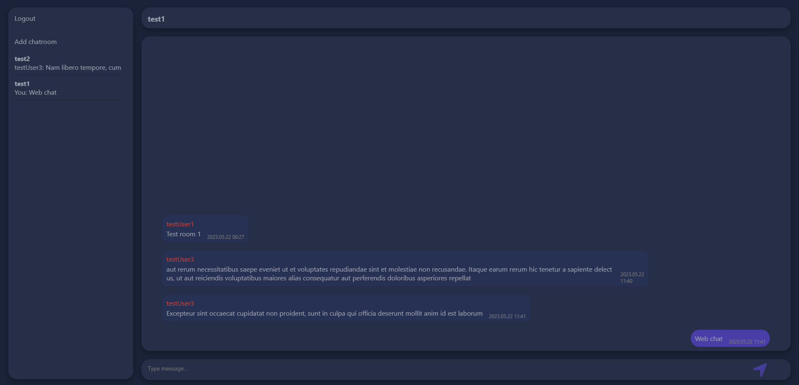

# 💬 Web Chat - Real-Time Messaging

A dynamic web chat application that enables seamless real-time communication between users across multiple chatrooms.

## 🌟 Features

- ⚡ **Real-time Messaging**: Instant chat updates using WebSockets
- 🔄 **Multiple Chatrooms**: Users can join and switch between different chatrooms
- 💾 **Message Persistence**: Saves chat history to MongoDB
- 📝 **User Registration & Login**: Secure account creation and authentication
- 🔐 **JWT Authentication & Encryption**: Ensures secure user sessions and encrypted passwords
- 📜 **Lazy Loading Messages**: Older messages load dynamically on scroll-up for a smooth experience

## 🛠 Technologies

- ⚙️ **Backend**: Node.js (Express, Socket.io, Mongoose)
- 🎨 **Frontend**: React.js
- 🗄 **Database**: MongoDB

## 🖥 Interface Demo

### 📝 Registration

### 🔑 Login

### 💬 Main Chat Page

### 📢 Another Chatroom

### ➕ Add Chatroom Modal

🚀 **Stay connected with Web Chat!**
