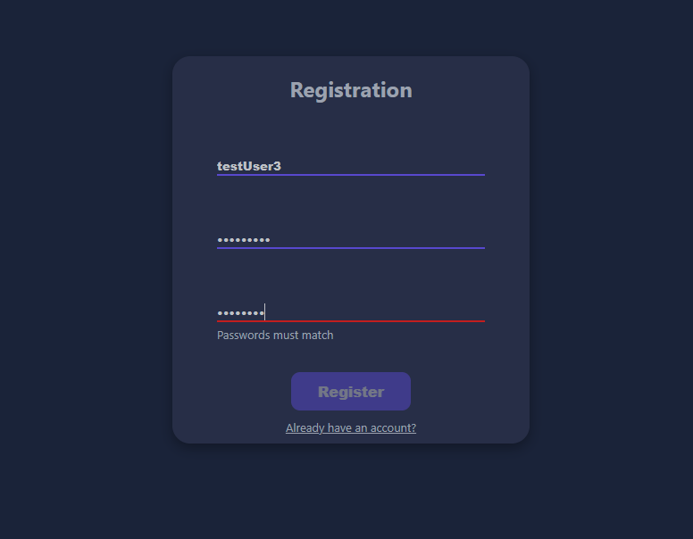
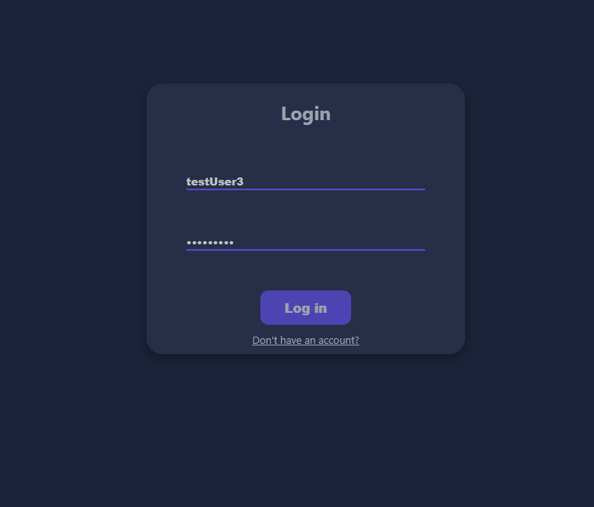
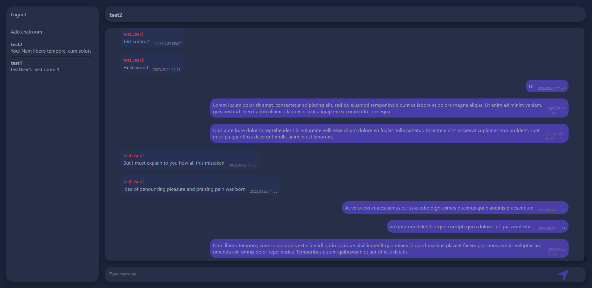
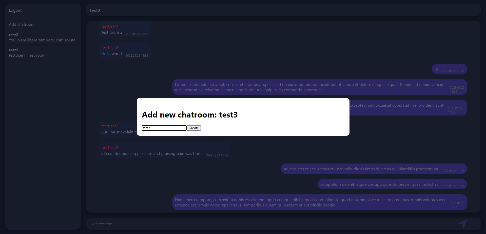

# Web-chat

### Features

- Real-time chating between multiple users
- Different chatrooms
- Saving messages to MongoDb
- Registraton and login
- Jwt authentication and password encryption

### Technologies

- Node.js: express, socket.io, mongoose
- React.js
- MongoDB

### Interface demo

